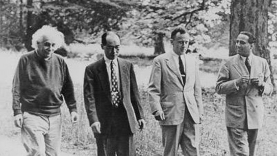

# Physik zum Spazieren gehen

Ein audio-only podcast zum Physikunterricht an der ZHAW in Wädenswil. 

Er ermöglicht das Lernen ohne vor dem Bildschirm sitzen zu müssen.

Spazieren gehen macht einen klaren Kopf, regt die Kreativität an und fördert das körperliche Wohlergehen. 

